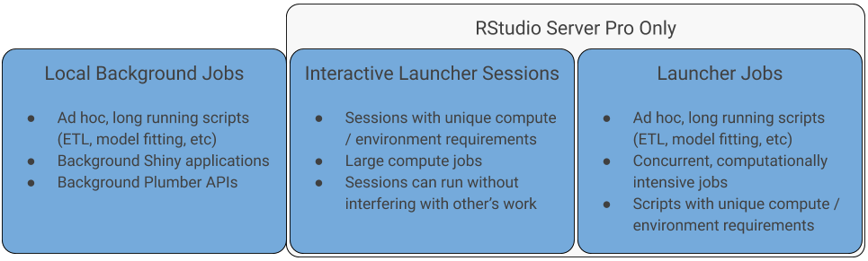

# RStudio 1.2 Background Jobs

[RStudio 1.2](https://www.rstudio.com/products/rstudio/) introduced the ability
to send long running R scripts to [local and remote background
jobs](https://blog.rstudio.com/2019/03/14/rstudio-1-2-jobs/). This functionality
can dramatically improve the productivity of data scientists and analysts using
R since they can continue working in RStudio while jobs are running in the
background. Local background jobs are supported by all versions of RStudio,
server and desktop. Remote background jobs are a feature of [RStudio Server
Pro](https://www.rstudio.com/products/rstudio-server-pro/) and are orchestrated
by the [RStudio Job Launcher](https://docs.rstudio.com/job-launcher/), which
also supports running interactive R sessions on remote resource managers like
[Kubernetes](https://kubernetes.io). The following helps illustrate general use
cases for these new features:

Background jobs can be started manually or programatically. As mentioned in the
[RStudio blog post](https://blog.rstudio.com/2019/03/14/rstudio-1-2-jobs/),
local background jobs are ideal for interactive, ad-hoc usage. The
[`callr`](https://blog.rstudio.com/2019/03/14/rstudio-1-2-jobs/) package
provides a mechanism for programatically orchestrating background R processes.
This repository is a collection of resources used to demonstrate various use
cases for local and remote background jobs. In many cases, scripts can be run as
local or remote jobs. For the resources collected here, :house: indicates
examples for local Jobs while :rocket: indicates jobs suited for the Launcher.

---
#### Local Job Environments :house:
Simple script that can be used to demonstrate local job environment options.

#### [Shiny App](shiny-job) :house:
Running a [Shiny](http://shiny.rstudio.com) application as a background job
allows the current R session to remain free to work on other things. This can be
especially helpful for making changes to the Shiny code and refreshing the app
to see the changes in real time.

#### [Plumber API](plumber-job) :house:
Similar to Shiny applications, [plumber](https://www.rplumber.io) APIs can be
run as a background job. This allows the current R session to remain open for
things like testing or interacting with the API.

#### [Extract, Transform, Load (ETL)](etl-job) :house: :rocket:
Background jobs are ideal for long running processes, like loading data from an
external database or API.

#### [Simulations](simulation-job) :house: :rocket:
Long running tasks like simulation studies can be run as background jobs in
order to keep the original R session open for other work.

#### Model Training :house: :rocket:
Model training, which can often take a long time, is another great use case for
background jobs. Launcher jobs can be used to train multiple models in parallel.
