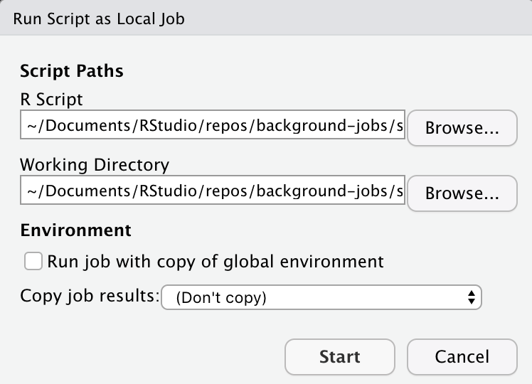

# Shiny apps in background jobs

Shiny apps can be run in local background jobs. This promotes a workflow of
running the app in the background, making changes to the source code in the
original R session, and checking the app to see the updated changes.

## Starting the app
Shiny applications start with a call to `shiny::runApp()`. In order to run an
app in the background, you can create a helper script like
[`shiny-run.R`](shiny-run.R) that calls `shiny::runApp()`. You can start a
background job by clicking on the Jobs pane and then *Start Local Job*:

For Shiny applications, all of the default job options work well. 

## Viewing the app
Once the job is started, the Jobs pane will show the URL that can be used to
access the application. On both RStudio desktop and RStudio Server, you can use
`rstudioapi::viewer()` with the URL of the application to open the application
in the RStudio Viewer pane. 

If you would like to view the app in an external browser window, with RStudio
desktop you can simply copy and paste the app URL into a browser. On RStudio
Server, you can use `rstudioapi::translateLocalUrl(<URL>, absolute = TRUE)` and
copy and paste the resulting URL into a browser window.

## Editing the app
Once the application is opened in the Viewer pane, you can make changes to the
application source code in the interactive R session and the app will
automatically refresh with the changes. This is happens by setting the
`shiny.autoreload` option to `TRUE`, which is done in
[`shiny-run.R`](shiny-run.R).

