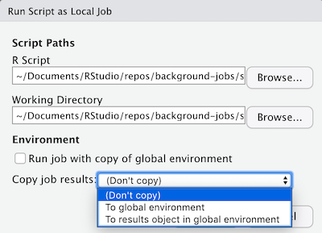

```{r setup, include=FALSE}
knitr::opts_chunk$set(eval = FALSE)
knitr::read_chunk("setup.R")
```

When a local job is run, a popup like the one below is shown:



This window provides several options about how to run the job. The
**Environment** section of the window contains options for handling the
environment of the background job. A background job can be run with a copy of
the global environment of the active R session, which is useful if the job
depends on variables or functions defined in the current global environment. By
default, the state of a background R process is discarded when the job is
completed. However, there are options to copy job results into the global
environment or to copy job results into a new environment. *If job results are
copied into the global environment, they will silently overwrite any objects
with the same names.*

This example contains two scripts used to highlight how the options described
above impact background jobs.

## Setup
The [`setup.R`](setup.R) script sets up a global environment with 3 variables:
`x`, `y`, and `z`.

```{r environment setup}
```

With this setup, [`simple.R`](simple.R) can be run as a background job with
various environment options enabled in order to understand how each option
impacts the background job and the global environment.


